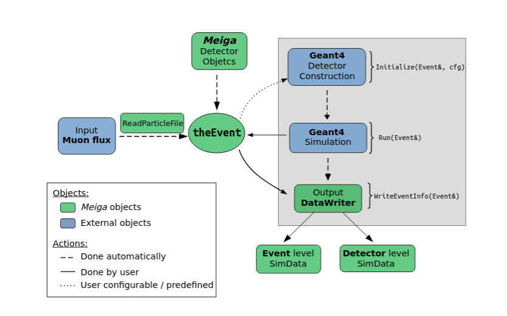
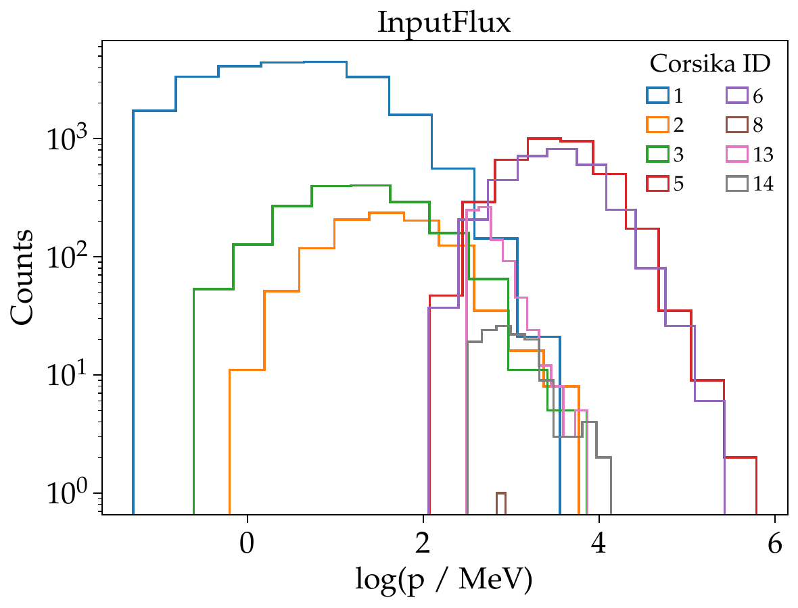
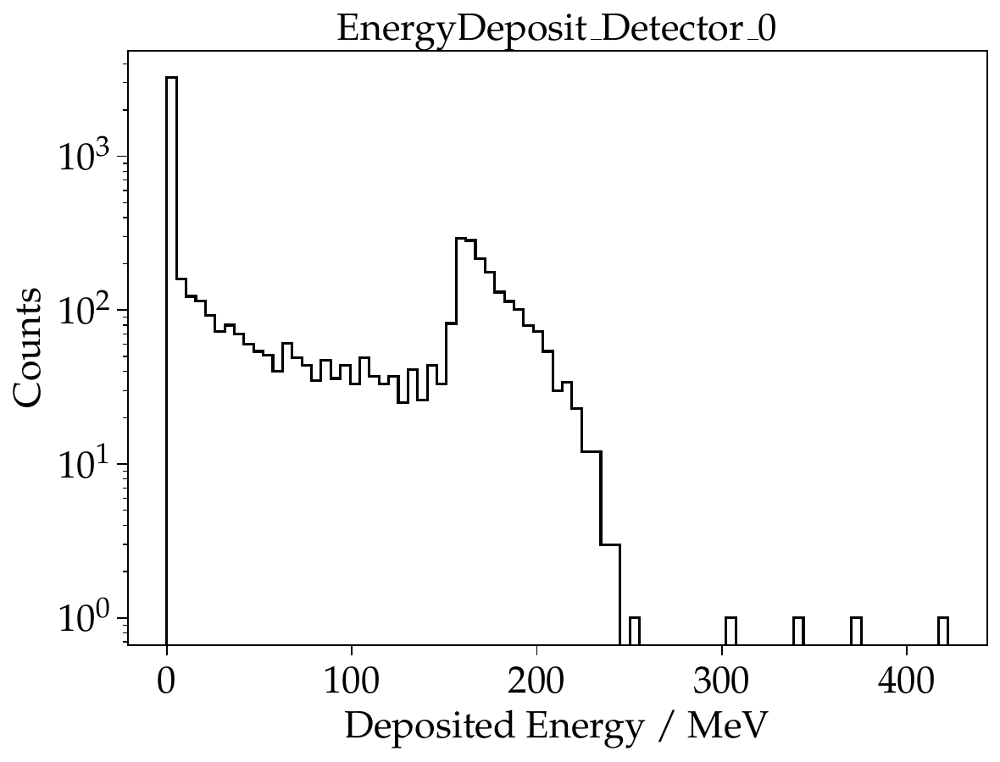
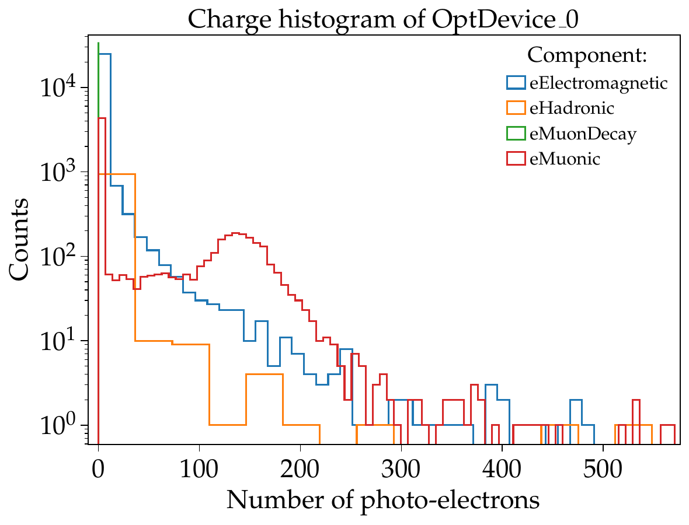

# meiga

[](https://zenodo.org/badge/latestdoi/595798217)


<!-- TABLE OF CONTENTS -->
<details>
  <summary>Table of Contents</summary>
<br />
  <ol>
    <li><a href="#introduction">Introduction</a></li>
    <li><a href="#getting-started">Getting started</a></li>
    <li><a href="#framework-structure">Framework structure</a></li>
    <li><a href="#input-flux">Input flux</a></li>
    <li><a href="#applications">Applications</a></li>
    <li><a href="#simulation-output">Simulation Output</a></li>
    <li><a href="#contact">Contact</a></li>
  </ol>
</details>
 

# Introduction
Meiga is a framework designed to develop astroparticle simulations and their possible applications. It is a set of classes written in C++ that connects the particle flux simulation with the response of a given detector through Geant4. The framework is designed with a hierarchical structure for data transfer and access and also provides an interface for the user to configure the parameters of the simulation or detector design.

# Getting started

### Pre-requisites
Prior to install and use Meiga, the following packages need to be installed:

- **Geant4**:\
  Meiga uses Geant4 as a toolkit for simulating the interaction of particles with the detector. Current version used is **geant4-07.p03** and can be downloaded from the [source page](https://geant4.web.cern.ch/support/download_archive). Geant4 must be built with X11 OpenGL drivers (in order to enable visualization) and with DATA packages enabled:
```bash
$cmake -DCMAKE_INSTALL_PREFIX=<path-to-install> -DGEANT4_INSTALL_DATA=ON -DGEANT_USE_OPENGL_X11=ON <path-to-source>
```
  See [Geant4 installation guide](https://geant4-userdoc.web.cern.ch/UsersGuides/InstallationGuide/html/) for details.

- **[boost](https://www.boost.org/)** (version > 1.75)\
  Can be installed via
```bash
sudo apt-get install libboost-all-dev
```

- **[nlohmann-json](https://github.com/nlohmann/json.git)** \
  For JSON parsers. Can be installed via:
```bash
  sudo apt-get install nlohmann-json-dev
```
- **view3dscene** (or similar) for visualization of .wrl files:
```bash
  sudo apt-get install view3dscene
```

### Setting your environment
Before installing Meiga, be sure that Geant4 and the DATA packages are correctly located in the system. Just add the following lines to your `~/.bashrc` file:
```bash
# assume your Geant4 installation is under $HOME/lib/geant4
# source the Geant4 environment
source $HOME/lib/geant4/install/bin/geant4.sh
# export all DATA packages
G4COMP="$HOME/lib/geant4/install/share/Geant4-10.7.3"
export G4ABLA=$G4COMP/data/G4ABLA3.1
export G4EMLOW=$G4COMP/data/G4EMLOW7.13
export G4ENSDFSTATE=$G4COMP/data/G4ENSDFSTATE2.3
export G4INCL=$G4COMP/data/G4INCL1.0
export G4NDL=$G4COMP/data/G4NDL4.6
export G4PARTICLEXS=$G4COMP/data/G4PARTICLEXS3.1.1
export G4PII=$G4COMP/data/G4PII1.3
export G4SAIDDATA=$G4COMP/data/G4SAIDDATA2.0
export PhotonEvaporation=$G4COMP/data/PhotonEvaporation5.7
export RadioactiveDecay=$G4COMP/data/RadioactiveDecay5.6
export RealSurface=$G4COMP/data/RealSurface2.2
```
### Installation

1. Get the source code from the repository:
```bash
git clone git@github.com:ataboadanunez/meiga.git
``` 
2. In the cloned directory, create the `build` and `install` directories
3. In the `build` directory type:
```bash
cmake -DCMAKE_INSTALL_PREFIX=../install ../src
```
4. Then build and install:
```bash
make -jN; make install;
```
5. The applications will be built in the `build/Applications` directory where the executables are located.
To run an example application go to `build/Applications/G4ExSimulator` and type:
```bash
./G4ExSimulator -c G4ExSimulator.json
``` 
The usage of configuration files will be addressed in the [Applications](#applications) section.

# Framework structure

The Meiga framework has a hierarchical structure that allows easy data access. 


- Event:\
The _Event_ is at the top of the structure and is used as a main vehicle for data flowing. In this sense, an _Event_ object is often passed as argument of the functions in the framework in such a way that data can be accessed to in any part of the code.
- Detector:\
The _Detector_ class provides an iterface to the _Event_ from which de detector description can be read. It contains the necessary methods for setting the detector properties and the functions to read these properties from configuration files, i.e., the conection between User and Geant4.
- SimData:\
Data from simulation is stored in the class _SimData_. This class has a hierarchical strcuture itself  for accessing data at different levels, for example, energy deposition of particles in a detector (_DetectorSimData_) or signal produced in a given optical sensor (_OptDeviceSimData_).

An example of how data can be accessed would be:

```cpp
double len = theEvent.GetDetector(detId).GetBarLength();
```

returns the length of a scintillator bar of a given detector with id `detId`.

```cpp
vector<double> Edep = theEvent.GetSimData().GetDetectorSimData(detId).GetEnergyDeposited();

```

returns the energy deposited of particles in that particular detector.

- G4Models:\
Everything related to the Geant4 _DetectorConstruction_ which can be described in a general way independently of any application is stored in the _G4Models_. For example, definition of materials, compounds and their physical properties but also detectors are described as independent classes within _G4Models_. 

- IO:\
Contains all functions related to the handling of Input/Output. 

- Utilities:\
Contains functions and classes which are used by the rest of the framework. Examples are `Geometry` or the `Particle` class.

The strcuture and workflow of the Meiga framework is shown in the diagram below. The _Meiga_ classes are represented in green while external packages (Geant4 and generators of input farticles) are represented in blue. The gray area shows the workflow of an _Application_. Arrows indicate the flow of information and whether a process is done automatically or can be configurable / done by the user.

*Structure of the Meiga framework*

# Input flux

The framework takes as input a flux of particles which is stored in form of a _particle vector_. Each element of the vector is of the type `Particle` and contains all the information related to the particle which will be propagated (injected) and simulated. At the current version, the flux of particles can be injected from two sources: reading an existing file (using the ARTI framework), or randomly generated (using the EcoMug library).

### The ARTI input

Obtaining a more realistic particle flux may be relevant in order to obtain higher accuracy in our simulated data. For this purpose, the [ARTI framework](https://github.com/lagoproject/arti#top) can be used to calculate the flux of particles generated by cosmic-ray-induced showers in the atmosphere.   

The flux of galactic cosmic rays is given by
```math
\Phi(E_{p}, Z, A, \Omega) = j_{0}(Z, A) \left( \frac{E_{p}}{E_{0}}\right)^{\alpha(E_{p}, Z, A)}, 
``` 
where $E_{p}$ is the energy of the primary cosmic ray of atomic number _Z_ and mass number _A_, $\Omega$ is the solid angle, $j_{0}$ is a normalization parameter, and $E_0 = 10^3~\mathrm{GeV}$. The spectral index $\alpha$ is consider independent of the primary energy for a wide range of energies ($10^{11} \ \mathrm{eV}$ to $10^{15} \ \mathrm{eV}$). As charged particles are affected by the geomagnetic field, ARTI uses the coordinates of the logal geomagnetic field, $B_x$ and $B_z$, as well as the altitude of the observation level to obtain an accurate estimation of the flux of particles at any desired site. 

The information of the particle flux computed by ARTI is given in an ASCII file where each line represents one particle, and 12 columns with information about the particle ID, particle momentum, angular coordinates and information about its primary cosmic ray. An example is given in the following table:


```bash
# # # shw
# # CURVED mode is ENABLED and observation level is 956 m a.s.l.
# # This is the Secondaries file - ARTI     v1r0
# # 12 column format is:
# # CorsikaId px py pz x y z shower_id prm_id prm_energy prm_theta prm_phi
0005 -1.67029e+00 +2.52492e-01 +3.79519e+00 -2.26858e+03 -3.77545e+03 +9.54478e+02 00000001 0703 +1.41286e+02 +22.098 +149.536
0005 -3.17177e-02 -1.21972e-02 +3.47233e-01 +2.36552e+03 -3.25636e+03 +9.54729e+02 00000001 0703 +1.41286e+02 +22.098 +149.536
0005 +1.10976e+00 +1.52449e+00 +1.55494e+00 -1.53852e+02 -1.22788e+03 +9.55880e+02 00000002 0703 +1.27323e+02 +50.622 +056.129
0006 +8.61081e-01 +1.60220e+00 +1.40590e+00 -3.54074e+03 +9.62486e+01 +9.55016e+02 00000002 0703 +1.27323e+02 +50.622 +056.129
0005 +1.50211e-01 +2.97882e-01 +4.45445e-01 -6.19894e+03 -5.66025e+03 +9.50471e+02 00000002 0703 +1.27323e+02 +50.622 +056.129
0001 +4.46898e-05 -3.83559e-05 +1.19358e-04 +5.39763e+00 -4.13637e+03 +9.54657e+02 00000003 0703 +1.47967e+02 +52.981 -063.175
0001 +2.24420e-03 -3.83343e-03 +3.06014e-03 +8.78293e+02 -4.82531e+03 +9.54113e+02 00000003 0703 +1.47967e+02 +52.981 -063.175
```
where particles are given by their [CORSIKA](https://www.iap.kit.edu/corsika/) ID, and the momentum is given in units of GeV. This is the information needed by Meiga to know which particle and how to propagate it (energy and direction).

### The EcoMug input

One of the original purposes of the Meiga framework was to perform simulations for Muography. For this reason, we have incorporated the [EcoMug](https://github.com/dr4kan/EcoMug/tree/main) library to generate samples of atmospheric muons without the need of an input file. It is a simple header file included in the `Utilities` and its functions for generating the muon energy and position distributions are properly integrated within the framework.

# Applications

The structure of classes and functionalities mentioned in  the [Framework structure](#framework-structure) section represent the base of the Meiga framework. The
simulation task is integrated into what is called
_Applications_, where each application is composed of three sequential methods
that read the configuration, run the simulation, and write the output files, respectively:

- `Initialize`:
  Is called at the beginning of the execution and is used to set up and load information to the `Event` object. It reads the configuration (JSON) file with information about the input type, detector information, simulation and output settings.  
- `RunSimulation`:
  Invokes the Geant4 classes for running the simulation based on the configuration given previously. Each particle is injected _one-by-one_, i.e., represents a `G4Run` and a `G4Event`, meaning that when Geant4 stops propagating a particle, the next particle in the loop is injected. In this sense, simulation data is stored _particle-by-particle_.
- `WriteInfo`:
  Once the Geant4 simulation ends, this method is called and the output of the simulation is dumped into a JSON file, storing the detector signals produced by each particle in an format easy to read. 

All the relevant information of an application is located in the `main()` function where all the classes and functions are linked. After compilation, an executable is created and is run by typing:
```bash
./executable -c configuration.json
```
where `configuration.json` is the configuration file modified by the user.

### The Configuration.json file

The configuration settings are written in a JSON file like the example below:

```json 
{
  "Input" :
  {
    "Mode" : "UseARTI",
    "InputFileName" : "./input.shw",
    "InputNParticles" : 0
  },
  "Output" : 
  {
    "OutputFile" : "./output.json",
    "CompressOutput" : true,
    "SavePETimeDistribution" : false,
    "SaveComponentsPETimeDistribution" : false,
    "SaveTraces" : false,
    "SaveEnergy" : false,
    "SaveComponentsEnergy" : false
  },
  "DetectorList" : "./DetectorList.xml",
  "DetectorProperties" : "./DetectorProperties.xml",
  "Simulation" :
  {
    "SimulationMode" : "eFull",
    "InjectionMode" : "eRandom",
    "GeoVisOn" : true,
    "TrajVisOn" : false,
    "CheckOverlaps" : false,
    "Verbosity" : 1,
    "RenderFile" : "VRML2FILE",
    "PhysicsName" : "QGSP_BERT_HP"
  }
}

```

- `Mode`: can be `UseARTI` or `UseEcoMug` for selecting between the two input types (see [Input flux](#input-flux)).
- `InputFileName`: path to input file in case `UseARTI` is chosen.
- `InputNParticles`: number of *muons* to be injected in case `UseEcoMug` is chosen.
- `OutputFile`: path to the output file.
- `CompressOutput`: if `True`, a `.tar.gz` with the output will be generated.
- `SavePETimeDistribution`: save photo-electron time distributions for each injected particle.
- `SaveComponentsPETimeDistribution`: save photo-electron time distributions by particle component (electromagnetic, muons, hadrons).
- `SaveTraces`: save analog time traces in the detector.
- `SaveEnergy`: save energy deposits in the detector.
- `SaveComponentsEnergy`: save energy deposits in the detector by particle component.
- `DetectorList`: path to the detector list file.
- `DetectorProperties`: path to file with the default detector properties.
- `SimulationMode`: `eFull` by default. Some applications allow `eFast` for fast simulation (e.g., kill secondary particles). Must be implemented by the user in the _G4UserAction_ class(es). 
- `GeoVisOn` and `TrajVisOn`: if `True`, a render file with geometry (and particle trajectories) of the detector is generated.
- `CheckOverlaps`: if `True` detects overlaps between detector volumes.
- `Verbosity`: level of Geant4 verbosity output.
- `RenderFile`: type of render file. For now, only .wrl files are allowed.
- `PhysicsName`: name of the physics list.

### Detector configuration

The detector's configuration used on each Application are specified in the `DetectorList.xml` file. In this file, each detector is called under the tag `<detector>`, where the `id` and `type` of the detector are given. NOTE: the detector `id` must be **unique**. Detector properties such as position (`<x>`, `<y>`, `<z>`) and custom parameters are defined within the `<detector>` tag. Otherwise, default parameters will be taken (see `src/Framework/ConfigManager/DetectorProperties.xml`).

The `DetectorList.xml` file also sets the particle injection configuration. This is written under the tag `<injectionMode>` where the following injection types are available:

- eCircle: particles are injected in a circle of radius `<radius>` and at height `<height>`.
- eHalfSphere: partilces are injected over a semi-sphere of radius `<radius>` and origin `<x>`, `<y>`, `<z>`.
- eVertical: particles are injected vertically at a fixed position (given by `<x>`, `<y>`, `<z>`).
- eFromFile: injection coordinates are taken from the input file.

An example of a `DetectorList.xml` file is given bellow:

```XML
<?xml version='1.0' encoding='ISO-8859-1'?>

<detectorList>
  
  <injectionMode type="eCircle">
    <!-- injection parameters -->
    <x unit="m"> 0 </x>
    <y unit="m"> 0 </y>
    <z unit="m"> 1 </z>
    <radius unit="m"> 1 </radius>
    <height unit="m"> 1.5 </height>
  </injectionMode>

  <detector id="0" type="eScintillator">
    <x unit="cm"> 0.0 </x>
    <y unit="cm"> 0.0 </y>
    <z unit="cm"> 0.0 </z>
    <barWidth unit="cm"> 4 </barWidth>
    <barThickness unit="cm"> 1 </barThickness>
    <barLength unit="cm"> 32 </barLength>
    <numberOfBars> 4 </numberOfBars>
  </detector>

</detectorList>
```

# Simulation Output

The simulation output is stored in the JSON file whose path and options were specified in the `Configuration.json` file. To extract the data and visualize the simulation output, the user is provided with a Python script in `src/Analysis/read_output.py`. The usage of this script is
```bash
./read_output.py -c Configuration.json
```
The Python script will fetch the output configuration from the configuration file, read the corresponding data and show relevant statistics as in the example bellow.

### Example

For this example, the `G4WCDSimulator` application was run using the following settings in the `G4WCDSimulator.json` file:

```JSON
"Input" : {
  "Mode" : "UseARTI",
  "InputFileName" : "../../../src/Documentation/SampleFlux/salida_bga_30.shw",
},
"Output" : {
  "OutputFile" : "./output.json",
  "SaveInput" : true,
  "SaveComponentsPETimeDistributions" : true,
  "SaveEnergy" : true
}
```

Running the `read_output.py` script using that configuration produces the following plots:







# Multiple processes


# Contact

The Meiga Framework is developed and maintained by [Alvaro Taboada (@ataboadanunez)](https://github.com/ataboadanunez/).

Contact via [email](mailto:alvaro.taboada.nunez@gmail.com).
