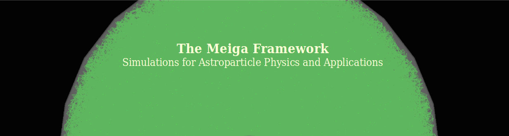

# meiga

[](https://zenodo.org/badge/latestdoi/595798217)


<!-- TABLE OF CONTENTS -->
<details>
  <summary>Table of Contents</summary>
<br />
  <ol>
    <li><a href="#introduction">Introduction</a></li>
    <li><a href="#getting-started">Getting started</a></li>
    <li><a href="#framework-structure">Framework structure</a></li>
    <li><a href="#input-flux">Input Flux</a></li>
    <li><a href="#applications">Applications</a></li>
    <li><a href="#simulation-output">Simulation Output</a></li>
    <li><a href="#analysis">Analysis</a></li>
    <li><a href="#runjobs">RunJobs</a></li>
    <li><a href="#contact">Contact</a></li>
  </ol>
</details>
 

# Introduction
Meiga is a framework designed to develop astroparticle simulations and their possible applications. It is a set of classes written in C++ that connects the particle flux simulation with the response of a given detector through Geant4. The framework is designed with a hierarchical structure for data transfer and access and also provides an interface for the user to configure the parameters of the simulation or detector design.

# Getting started

### Pre-requisites
Prior to install and use Meiga, the following packages need to be installed:

- **Geant4**:\
  Meiga uses Geant4 as a toolkit for simulating the interaction of particles with the detector. Current version used is **Geant4 11.2.1** and can be downloaded from the [source page](https://geant4.web.cern.ch/download/11.2.1.html). Geant4 must be built with X11 OpenGL drivers (in order to enable visualization) and with DATA packages enabled:
```bash
$cmake -DCMAKE_INSTALL_PREFIX=<path-to-install> -DGEANT4_INSTALL_DATA=ON -DGEANT_USE_OPENGL_X11=ON <path-to-source>
```
  See [Geant4 installation guide](https://geant4-userdoc.web.cern.ch/UsersGuides/InstallationGuide/html/) for details.

- **[boost](https://www.boost.org/)** (version > 1.75)\
  Can be installed via
```bash
sudo apt-get install libboost-all-dev
```
- **view3dscene** (or similar) for visualization of .wrl files:
```bash
  sudo apt-get install view3dscene
```

### Setting your environment
Before installing Meiga, be sure that Geant4 and the DATA packages are correctly located in the system. Just add the following lines to your `~/.bashrc` file:
```bash
# assume your Geant4 installation is under $HOME/lib/geant4
# source the Geant4 environment
source $HOME/lib/geant4/install/bin/geant4.sh
# export all DATA packages
G4COMP="$HOME/lib/geant4/install/share/Geant4"
export G4ABLA=$G4COMP/data/G4ABLA3.3
export G4EMLOW=$G4COMP/data/G4EMLOW8.15
export G4ENSDFSTATE=$G4COMP/data/G4ENSDFSTATE2.3
export G4INCL=$G4COMP/data/G4INCL1.2
export G4NDL=$G4COMP/data/G4NDL4.7
export G4PARTICLEXS=$G4COMP/data/G4PARTICLEXS4.0
export G4PII=$G4COMP/data/G4PII1.3
export G4SAIDDATA=$G4COMP/data/G4SAIDDATA2.0
export PhotonEvaporation=$G4COMP/data/PhotonEvaporation5.7
export RadioactiveDecay=$G4COMP/data/RadioactiveDecay5.6
export RealSurface=$G4COMP/data/RealSurface2.2
```
### Installation

1. Get the source code from the repository:
```bash
git clone git@github.com:ataboadanunez/meiga.git
``` 
2. In the cloned directory, create the `build` and `install` directories
3. In the `build` directory type:
```bash
cmake -DCMAKE_INSTALL_PREFIX=../install ../src
```
4. Then build and install:
```bash
make -jN; make install;
```
5. The applications will be built in the `build/Applications` directory where the executables are located.
To run an example application go to `build/Applications/G4ExSimulator` and type:
```bash
./G4ExSimulator -c G4ExSimulator.json
``` 
The usage of configuration files will be addressed in the [Applications](#applications) section.

# Framework structure

The Meiga framework has a hierarchical structure that allows easy data access. 


- Event:\
The _Event_ is at the top of the structure and is used as a main vehicle for data flowing. In this sense, an _Event_ object is often passed as argument of the functions in the framework in such a way that data can be accessed to in any part of the code.
- Detector:\
The _Detector_ class provides an interface to the _Event_ from which de detector description can be read. It contains the necessary methods for setting the detector properties and the functions to read these properties from configuration files, i.e., the connection between User and Geant4.
- SimData:\
Data from simulation is stored in the class _SimData_. This class has a hierarchical structure itself  for accessing data at different levels, for example, energy deposition of particles in a detector (_DetectorSimData_) or signal produced in a given optical sensor (_OptDeviceSimData_).

An example of how data can be accessed would be:

```cpp
double len = theEvent.GetDetector(detId).GetBarLength();
```

returns the length of a scintillator bar of a given detector with id `detId`.

```cpp
vector<double> Edep = theEvent.GetSimData().GetDetectorSimData(detId).GetEnergyDeposited();

```

returns the energy deposited of particles in that particular detector.

- G4Models:\
Everything related to the Geant4 _DetectorConstruction_ which can be described in a general way independently of any application is stored in the _G4Models_. For example, definition of materials, compounds and their physical properties but also detectors are described as independent classes within _G4Models_. 

- IO:\
Contains all functions related to the handling of Input/Output. 

- Utilities:\
Contains functions and classes which are used by the rest of the framework. Examples are `Geometry` or the `Particle` class.

The strcuture and workflow of the Meiga framework is shown in the diagram below. The _Meiga_ classes are represented in green while external packages (Geant4 and generators of input particles) are represented in blue. The gray area shows the workflow of an _Application_. Arrows indicate the flow of information and whether a process is done automatically or can be configurable / done by the user.

*Structure of the Meiga framework*

# Input Flux

The framework takes as input a flux of particles which is stored in form of a _particle vector_. Each element of the vector is of the type `Particle` and contains all the information related to the particle which will be propagated (injected) and simulated. At the current version, the flux of particles can be injected from two sources: reading an existing file (using the ARTI framework), or randomly generated (using the EcoMug library).

### The ARTI Input

Obtaining a more realistic particle flux may be relevant in order to obtain higher accuracy in our simulated data. For this purpose, the [ARTI framework](https://github.com/lagoproject/arti#top) can be used to calculate the flux of particles generated by cosmic-ray-induced showers in the atmosphere.   

The flux of galactic cosmic rays is given by
```math
\Phi(E_{p}, Z, A, \Omega) = j_{0}(Z, A) \left( \frac{E_{p}}{E_{0}}\right)^{\alpha(E_{p}, Z, A)}, 
``` 
where $E_{p}$ is the energy of the primary cosmic ray of atomic number _Z_ and mass number _A_, $\Omega$ is the solid angle, $j_{0}$ is a normalization parameter, and $E_0 = 10^3~\mathrm{GeV}$. The spectral index $\alpha$ is consider independent of the primary energy for a wide range of energies ($10^{11} \ \mathrm{eV}$ to $10^{15} \ \mathrm{eV}$). As charged particles are affected by the geomagnetic field, ARTI uses the coordinates of the logal geomagnetic field, $B_x$ and $B_z$, as well as the altitude of the observation level to obtain an accurate estimation of the flux of particles at any desired site. 

The information of the particle flux computed by ARTI is given in an ASCII file where each line represents one particle, and 12 columns with information about the particle ID, particle momentum, angular coordinates and information about its primary cosmic ray. An example is given in the following table:


```bash
# # # shw
# # CURVED mode is ENABLED and observation level is 956 m a.s.l.
# # This is the Secondaries file - ARTI     v1r0
# # 12 column format is:
# # CorsikaId px py pz x y z shower_id prm_id prm_energy prm_theta prm_phi
0005 -1.67029e+00 +2.52492e-01 +3.79519e+00 -2.26858e+03 -3.77545e+03 +9.54478e+02 00000001 0703 +1.41286e+02 +22.098 +149.536
0005 -3.17177e-02 -1.21972e-02 +3.47233e-01 +2.36552e+03 -3.25636e+03 +9.54729e+02 00000001 0703 +1.41286e+02 +22.098 +149.536
0005 +1.10976e+00 +1.52449e+00 +1.55494e+00 -1.53852e+02 -1.22788e+03 +9.55880e+02 00000002 0703 +1.27323e+02 +50.622 +056.129
0006 +8.61081e-01 +1.60220e+00 +1.40590e+00 -3.54074e+03 +9.62486e+01 +9.55016e+02 00000002 0703 +1.27323e+02 +50.622 +056.129
0005 +1.50211e-01 +2.97882e-01 +4.45445e-01 -6.19894e+03 -5.66025e+03 +9.50471e+02 00000002 0703 +1.27323e+02 +50.622 +056.129
0001 +4.46898e-05 -3.83559e-05 +1.19358e-04 +5.39763e+00 -4.13637e+03 +9.54657e+02 00000003 0703 +1.47967e+02 +52.981 -063.175
0001 +2.24420e-03 -3.83343e-03 +3.06014e-03 +8.78293e+02 -4.82531e+03 +9.54113e+02 00000003 0703 +1.47967e+02 +52.981 -063.175
```
where particles are given by their [CORSIKA](https://www.iap.kit.edu/corsika/) ID, and the momentum is given in units of GeV. This is the information needed by Meiga to know which particle and how to propagate it (energy and direction).

### The EcoMug Input

One of the original purposes of the Meiga framework was to perform simulations for Muography. For this reason, we have incorporated the [EcoMug](https://github.com/dr4kan/EcoMug/tree/main) library to generate samples of atmospheric muons without the need of an input file. It is a simple header file included in the `Utilities` and its functions for generating the muon energy and position distributions are properly integrated within the framework.

# Applications

The structure of classes and functionalities mentioned in  the [Framework structure](#framework-structure) section represent the base of the Meiga framework. The
simulation task is integrated into what is called
_Applications_, where each application is composed of three sequential methods
that read the configuration, run the simulation, and write the output files, respectively:

- `Initialize`:
  Is called at the beginning of the execution and is used to set up and load information to the `Event` object. It reads the configuration (JSON) file with information about the input type, detector information, simulation and output settings.  
- `RunSimulation`:
  Invokes the Geant4 classes for running the simulation based on the configuration given previously. Each particle is injected _one-by-one_, i.e., represents a `G4Run` and a `G4Event`, meaning that when Geant4 stops propagating a particle, the next particle in the loop is injected. In this sense, simulation data is stored _particle-by-particle_.
- `WriteEventInfo`:
  Once the Geant4 simulation ends, this method is called and the output of the simulation is dumped into a JSON file, storing the detector signals produced by each particle in an format easy to read. 

All the relevant information of an application is located in the `main()` function where all the classes and functions are linked. After compilation, an executable is created and is run by typing:
```bash
./executable -c configuration.json
```
where `configuration.json` is the configuration file modified by the user.

### The Configuration.json file

The configuration settings are written in a JSON file like the example below:

```json 
{
  "Input" :
  {
    "Mode" : "UseARTI",
    "InputFileName" : "./input.shw",
    "InputNParticles" : 0
  },
  "Output" : 
  {
    "OutputFile" : "./output.json",
    "CompressOutput" : true,
    "SavePETimeDistribution" : false,
    "SaveComponentsPETimeDistribution" : false,
    "SaveTraces" : false,
    "SaveEnergy" : false,
    "SaveComponentsEnergy" : false
  },
  "DetectorList" : [
    {
      "Type" : "eScintillator",
      "Position" : [0, 0, 100],
      "BarLength" : 20
    },
    {
      "Type" : "eWCD",
      "Position" : [0, 0, 0],
      "TankRadius" : 40
    }
  ],
  "ParticleInjection" : {
    "Type" : "eVertical",
    "Origin" : [0, 0, 100]
  },
  "Simulation" :
  {
    "SimulationMode" : "eFull",
    "InjectionMode" : "eRandom",
    "GeoVisOn" : true,
    "TrajVisOn" : false,
    "CheckOverlaps" : false,
    "Verbosity" : 1,
    "RenderFile" : "VRML2FILE",
    "PhysicsName" : "QGSP_BERT_HP"
  }
}

```
Input Configuration
- `Mode`: can be `UseARTI` or `UseEcoMug` for selecting between the two input types (see [Input Flux](#input-flux)).
- `InputFileName`: path to input file in case `UseARTI` is chosen.
- `InputNParticles`: number of *muons* to be injected in case `UseEcoMug` is chosen.

Output Configuration
- `OutputFile`: path to the output file.
- `CompressOutput`: enable compression of output file (.gz).
- `SavePETimeDistribution`: save photo-electron time distributions for each injected particle.
- `SaveComponentsPETimeDistribution`: save photo-electron time distributions by particle component (electromagnetic, muons, hadrons).
- `SaveEnergy`: save energy deposits in the detector.
- `SaveCounts`: save particle counters (for scintillator bars).
- `SaveComponentsEnergy`: save energy deposits in the detector by particle component.

Detector Configuration
- `DetectorList`: block with the list of detectors to be simulated. The `Type` and `Position` of each detector are mandatory. See [Detector Configuration](#detector-configuration).

Particle Injection
- `ParticleInjection` : allowed injection `Type` are: `eVertical`, `eCircle`, `eHalfSphere` or `eFromFile`. For more information see [Particle Injection Configuration](#particle-injection-configuration).

Geant4 Settings
- `SimulationMode`: `eFull` by default. Some applications allow `eFast` for fast simulation (e.g., kill secondary particles). Must be implemented by the user in the _G4UserAction_ class(es). 
- `GeoVisOn` and `TrajVisOn`: if `True`, a render file with geometry (and particle trajectories) of the detector is generated.
- `CheckOverlaps`: if `True` detects overlaps between detector volumes.
- `Verbosity`: level of Geant4 verbosity output.
- `RenderFile`: type of render file. For now, only .wrl files are allowed.
- `PhysicsName`: name of the physics list.

# Detector Configuration

The detector's configuration used on each Application is specified in the `DetectorList` block of the configuration file. Each detector is specified with its `Type` and `Position`, which are mandatory fields. The position is coordinates are given in `cm`, and is responsability of the user to locate detectors properly to avoid overlaps.

In addition, users can customize basic detector properties. Customizable detector properties depend on the detector type. This is covered in the next section.

## Predefined Detector Models
Meiga provides predefined detector configurations commonly used in Astroparticle physics and muography such as a Water-Cerenkov Detector and a hodoscope made of scintillator planes:
*Example of predefined detectors in Meiga: a Water-Cerenkov Detector with a half-sphere PMT (left) and three Hodoscope detectors with WLS optical fibers (right).*

The detectors are defined as independent classes in the G4Models directory and are automatically build in the G4DetectorConstructor class of each application. The user needs to specify which detector type will be used and the location in the `DetectorList` block of the configuration file.


#### Water-Cerenkov Detector (`eWCD` and `eSaltyWCD`)
Consist of a water tank which uses a half-sphere photo-multiplier tube (PMT) to collect the Cerenkov photons produced in water produced by shower particles. Customizable properties are:
- `TankRadius` : radius of the WCD (in `cm`).
- `TankHeight` : height of the WCD (in `cm`).
- `ImpuritiesFraction` : fraction of water impurities from 0 to 1 (no unit).

#### Plastic Scintillator Detectors (`eScintillator` and `eHodoscope`)
Consist of grids of plastic scintillator bars traversed with wave-length optical fibers that collect and guide scintillation photons to a Geant4 volume placed at the end of the fiber and representing the optical device (multi-channel PMT or SiPM). Customizable detector properties are:
- `NumberOfBars` : number of scintillator bars in a scintillator-type detector.
- `BarLength` : length of the scintillator bars (in `cm`).
- `BarWidth` : width of the scintillator bars (in `cm`).
- `BarThickness` : thickness of the scintillator bars (in `cm`).


# Particle Injection

Particles are _injected_ following different configurations:

- `eCircle` : particles are randomly injected over a circle of radius `Radius` given in `cm` and origin of coordinates give in `cm` in the `Origin`.
- `eHalfSphere` : particles are injected over a half-sphere of radius `Radius` at the origin of coordinates given in `Origin`. In addition, limits for `theta` and `phi` angles can be specified under the fiels `MinTheta` (default 0) `MaxTheta` (default 90) and `MinPhi` (default 0) `MaxPhi` (default 360).
- `eVertical`: Particles are injected vertically at the `Origin` position.
- `eFromFile`: Particle's injection position is taken from the input file.

# Simulation Output

The simulation output is stored in a JSON format using the 
**[nlohmann-json](https://github.com/nlohmann/json.git)** library. The output is stored on an *event basis*: each "event" is stored with information about the input particle and detector output (such as deposited energy or signals), preserving the hierarchical structure of how data is stored in the framework.

The level of output to be stored can be set in the configuration file using the `Output` keys:

```JSON
"Output" : {
  
  "OutputFile" : "./output.json",
  "CompressOutput" : true,
  "SaveInput" : true,
  "SaveEnergy" : true,
  "SaveCounts" : true,
  "SavePETimeDistribution" : true,
  "SaveCharge" : true

}
```
This might depend on the detector configuration or application needs.

In addition to the simulation output, information of the DetectorList containing detector naming, positioning and list of optical device IDs are also stored in the output file.

# Example Applications
A few example applications are provided in the source code as well as python scripts to analyze the simulation output.
## G4WCDSimulator
Simulates a flux of secondary particles over a Water-Cerenkov Detector (WCD) containing a Photo-Multiplier Tube (PMT) at the center top of the tank. The dimenions of the tank (radius and height) can be set from the `DetectorList.xml`
```XML
<detector id="0" type="eWCD">
  <x unit="cm"> 0.0 </x>
  <y unit="cm"> 0.0 </y>
  <z unit="cm"> 0.0 </z>
  <tankRadius unit="cm"> 90 </tankRadius>
  <tankHeight unit="cm"> 120 </tankHeight>
</detector>
```
Regarding the simulation output, if `SavePETimeDistribution` is set to `true`, the photo-electro time distributions will be stored as arrays in the output file, thus allowing to reconstrcut the time profile of the particles entering in the water. In addition, if `SaveComponentsPETimeDistribution` is set to `true`, this information will be given by particle component type: _muonic_, _electromagnetic_ and _hadronic_. Same applies to the deposited energy in the water tank.

The code in `src/Analysis/G4WCDSimulator_Analysis.py` is provided to plot the simulation output.

## G4HodoscopeSimulator
Simulates a flux of muons using the `EcoMug` muon generator over three planes of scintillator panels (hodoscope). Each of the pannel has the type `eHodoscope` and constitutes an independent detector. In this way, users can simulate as many scintillator panels as needed and information will be stored accordingly. The number of scintillator bars per pannel as well as the dimensions of the scintillator bars can be set in the `DetectorList.xml` file:
```XML
<detector id="0" type="eHodoscope">
  <x unit="m"> 0.0 </x>
  <y unit="m"> 0.0 </y>
  <z unit="m"> 0.0 </z>

  <numberOfBars>            12  </numberOfBars>
  <barLength unit="cm">     50  </barLength>
  <barWidth unit="cm">      2   </barWidth>
  <barThickness unit="cm">  1   </barThickness>
</detector>

```
Regarding the simulation output: by setting the flag `SaveDepositedEnergy`, deposited energy per muon on each detector will be saved. In addition, the flag `SaveCounts` allows to store the hit of muons along each of the detector axis. The position is stored in a binary value of _2N_ bits where the first _N_ bits are reserved for the bars along the X-axis and the remaining _N_ bits are reserved for the bars along the Y-axis. A `1` represents a hit whereas a `0` means that that bar was not hit by the muon. For example, a binary value of `001000000000000100000000` means that the impinging muon has hit the bar number "3" along the X-axis and the bar number "4" along the Y-axis.

The code in `src/Analysis/G4HodoscopeSimulator_Analysis.py` can be used to plot the simulation output.

# Analysis

The simulation output is stored in a JSON format which can be easily accessed with a few lines of code. However, Meiga contains its own code to extract information from the output file using Python. The class `SimDataReader`, located in `src/Analysis`, contains methods to access data of the hierarchical structure. An example is given in the following python snippet: 

```python
from SimDataReader import *

# path to outputfile
outfile = './output.json.gz'
# create an instance of SimDataReader to access data
simData = SimDataReader(outfile)

# get input flux from simData
inputFlux = simData.get_input_flux()

# access to DetectorSimData by detector ID
detSimData = simData.GetDetectorSimData(det_id=0)

# example: get energy deposit of detector ID = 0
energy = detSimData.get_deposited_energy()

# access to OptDeviceSimData
odSimData = detSimData.GetOptDeviceSimData(od_id=0)

# example: get PE time distribution (time traces)
peTimeDist = odSimData.get_pe_time_distribution()
```
As shown in the example above, one can navigate through the different levels of data and access to detector and optical device data by their ID.

### Add `SimDataReader` to `PYTHONPATH`

In order to import the `SimDataReader` class from any location in your system, just add the following line to the `PYTHONPATH` in your `~/.bashrc` file:

```bash
# adding analysis directory to PYTHONPATH
export PYTHONPATH=$PYTHONPATH:/<path-to>/meiga/src/Analysis/
```

# RunJobs

Meiga simulations are executed as single processes meaning that only one core is used to run the simulation at a time. Although Geant4 has included multi-threading since version 10.0, this option has not been tested with Meiga applications yet. In the simulation, particles are injected **one-by-one** so simulating large amount of particles will take very long and heavy input files might also cause large RAM consumption. 

Meiga provides a tool called **RunJobs** which can be found in `src/Utilities/RunJobs`. The principle behind RunJobs consists of splitting the simulation of a large number of particles in many simulations of a smaller amount of particles. These simulations (or _jobs_) are then executed in **parallel**, reducing the total simulation time. At the same time, the _jobs_ are stored in a queue such that when one process ends, the next one in the queue is sent **automatically** until all processes are done. 

## How to use

First of all, checkout the `src/Utilities/RunJobs` directory where you will find two Python scripts for creating and executing the jobs:

- `createjobs.py`
- `runjobs.py`

and another script to merge the output in a single file:
- `mergeoutput.py`

Then, follow these steps:

1. Create a `base/` directory with the following files:
    - **Executable** of your Meiga Applications
    - A **BaseConfiguration.json** file for your application \
<span style="color:red">IMPORTANT</span>: copy this file from `src/Utilities/RunJobs/BaseConfiguration.json` and edit the settings of your simulation but **do not edit the flags between `@`!!!**

    - The **DetectorList.xml** and **DetectorProperties.xml** files of your application.

2. Create a `jobs/` directory

3. Execute `createjobs`:
    ```bash
    ./createjobs -i <path-input-file> -n <n_part> -b <path-to-base> -j <path-to-jobs>
    ```

This will split the input file containing $N_\mathrm{tot}$ lines into $N = N_\mathrm{tot} / n_\mathrm{part}$ files with $n_\mathrm{part}$ lines each. Then it will create $N$ subdirectories in `jobs/`, each with its corresponding configuration files.

4. Execute `runjobs`:

    ```bash
    ./runjobs -j <path-to-jobs> -n <n_threads>
    ```

Will execute the $N$ jobs in a queue using a maximum of $n_\mathrm{threads}$ at a time. Once the simulation finishes, the output file will be located in its corresponding job directory.

5. Use the `mergeoutput.py` to merge the generated output files in a single file:
  ```bash
  python3 mergeoutput.py -j <path-to-jobs> -o <path-to-merged-directory>
  ```
It will fetch the output files located in the jobs directory and merge in a single file that will be located in the `<path-to-merged-directory>` (if no output directory is given it will create a default `./merged_output`).

## Add RunJobs to your environment

The `createjobs` and `runjobs` executables can be found in the Meiga `bin` directory after installation. You can add this directory to your environment and create aliases to execute the RunJobs scripts from any location. This is an example of how you can do it in your `~/.bashrc` file:

```bash
# Path to the Meiga install directory
MEIGAINSTALL='<path-to>/meiga/install/bin/'
# Write alias to execute createjobs and runjobs
alias createjobs='python3 $MEIGAINSTALL/createjobs.py'
alias runjobs='python3 $MEIGAINSTALL/runjobs.py'
```


# Contact

The Meiga Framework is developed and maintained by [Alvaro Taboada (@ataboadanunez)](https://github.com/ataboadanunez/).

Contact via [email](mailto:alvaro.taboada.nunez@gmail.com).
